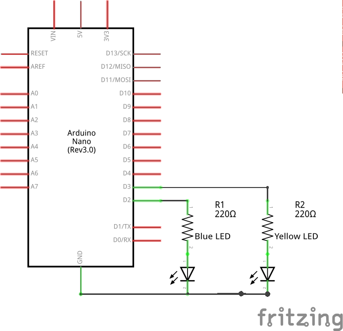
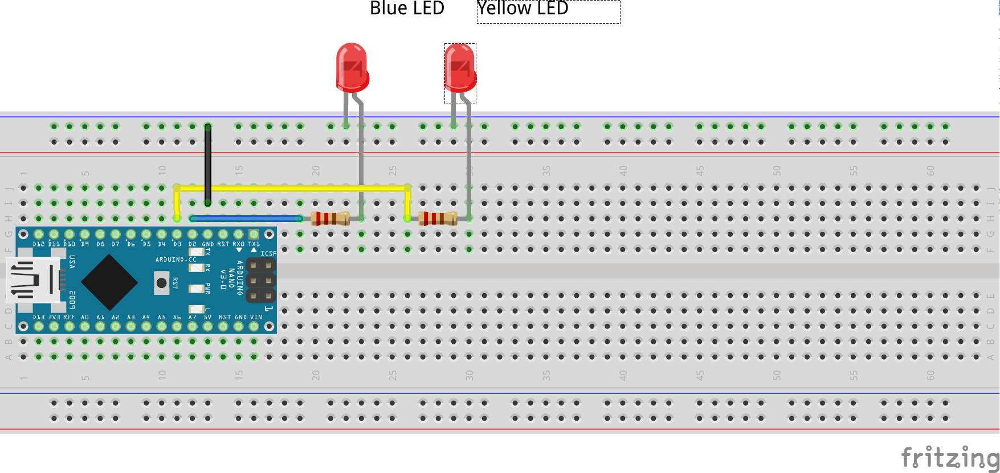

# Test Driven Development for Embedded Software

In this workshop we're going to test drive code to flash an LED (or two) using at ATMega328p microprocessor.  For simplicity we'll use an Arduino Nano clone to save wiring in a power supply and programmer.

## Circuit

The official Pinout for the Arduino Nano (and clones) is at https://content.arduino.cc/assets/Pinout-NANO_latest.png

We'll be using a pre-constructed circuit that conforms to this diagram:

For programming purposes, the blue led is connected to PD2, and the yellow led is connected to PD3.

## Software

We'll be using gcc's AVR toolchain to compile and link our softare.  CMake will be used to manage both the target build and the test build.